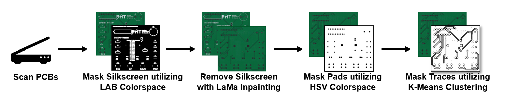
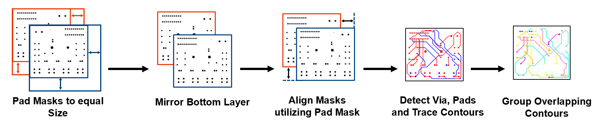
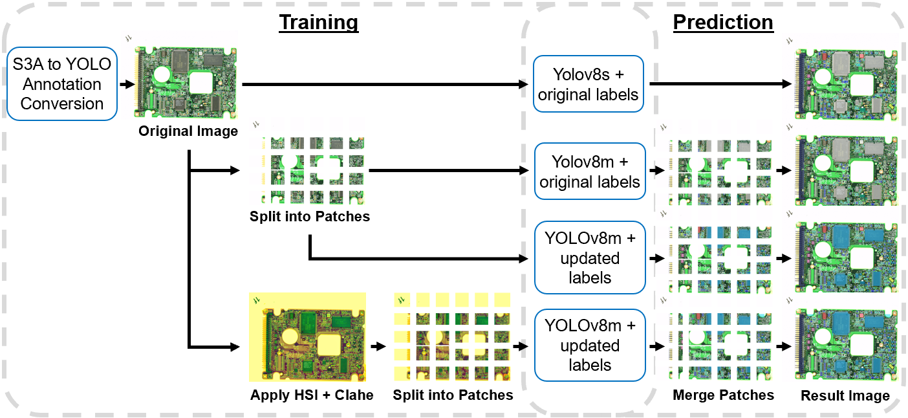

# Automated PCB based Circuit Reconstruction

## Introduction
Reconstruction and analysis of PCB's by hand is very complex and time consuming. This work aims to make some aspects of this easier by introducing two tool for PCB-Image analysis.

### Trace Detection
The trace detection is used to create a netlist of the PCB and connect the components on it. An image of the bare PCB is need for the trace detection to work. The image is then processed in multiple steps to remove the silkscreen, create masks of all pads and traces and connect the top and bottom layers


In it's current form the resulting netlist is returned in 2 images, one shows all traces sorted by top and bottom layer in red and blue while the second image shows the connected netlist, giving each net a unique color.


### Component detection
For the component detection multiple neural networks have been trained using the YOLOv8 framework and FPIC-Dataset (see related works), the best working one been the 3 net, with split images and updated labels. The network can detect the common SMD and THT components reliably and returns bounding boxes and segmentation masks for detected components.



## Related Work

## Installation

To install Automated_PCB_based_Circuit_Reconstruction and its dependencies, follow these steps:

1. Clone the repository to your local machine:

    ```bash
    git clone https://github.com/VivDue/Automated_PCB_based_Circuit_Reconstruction.git
    ```

2. Navigate to the cloned directory and replace your path with your save path:

    ```bash
    cd your_path/Automated_PCB_based_Circuit_Reconstruction
    ```

3. Create a virtual environment (optional but recommended):

    ```bash
    python -m venv .venv
    ```

4. Activate the virtual environment:

    - **Windows:**

    ```bash
    .venv\Scripts\activate.bat
    ```

    - **Linux/macOS:**

    ```bash
    source .venv/bin/activate
    ```

5. Install the required dependencies and replace the your_path with your save path:

    - `Using` requirements.txt:
    ```bash
    python -m pip install --upgrade pip
    python -m pip install -r your_path/requirements.txt
    ```

    - `Alternatively`, install packages individually:
    If the requirements.txt installation fails, you can install the necessary packages manually:
    ```bash
    python -m pip install opencv-python
    python -m pip install matplotlib
    python -m pip install ultralytics
    python -m pip install simple-lama-inpainting
    python -m pip install tqdm
    python -m pip install ipykernel
    ```

6. You are now ready to use the Automated_PCB_based_Circuit_Reconstruction in your Python projects.

## Trace Detection

### Usage

The `TraceDetection` class provides functionality to process PCB layer images and generate masks, create net lists, and visualize the results. The key methods are:

- `create_masks(layer_images)`: Generates masks for the background, silkscreen, traces, pads, vias, and inpainted images from the input layer images.
- `create_net_list(masks)`: Creates a net list based on the masks, which groups nets by traces and pads.
- `show(layer_images, masks=None, net_list=None, save=False, path=None)`: Visualizes the original layer images, masks, and net list in a grid. Optionally, the results can be saved to a specified path.

### Example

```python
from trace_detection import TraceDetection
import cv2

# Load images for each layer
top_layer = cv2.imread('images/pcbs/0001_bin_alarm/base_top.png')
bottom_layer = cv2.imread('images/pcbs/0001_bin_alarm/base_bottom.png')
layer_images = [top_layer, bottom_layer]

# Create Masks and show results
td = TraceDetection()
masks = td.create_masks(layer_images)
td.show(layer_images, masks)

# Create net list and show results
net_list = td.create_net_list(masks, mirror=[False, True])
td.show(layer_images, None, net_list)
```

### Component Detection

To predict the bounding boxes of components in an image using YOLO, you can use the `predict_file()` method. This method works as follows:

1. **Patch Generation**: The input image (typically a PCB image) is split into smaller patches, each of size 768x768 pixels. This ensures that the YOLO model can process the image without running into memory or size limitations.
2. **YOLO Prediction**: Each patch is fed into the YOLO model to detect the components. The detected components are saved as new images, with bounding boxes drawn around the detected objects.
3. **Recombination**: Once all patches have been processed, the method recombines them into the original image format. This can be saved in two forms:
   - The **Cut** image: Cropped to remove unnecessary borders.
   - The **All** image: The full recombined image without any cropping.

### Example

```python
from yolo_predict import YoloPredictor

# files and directories
input_file = "test\DSC_0250.jpg"
output_directory = "Predictions"
yolomodel = "models/yolov8m_updated_labels.pt"
cut_ends = False

# create an instance of the DesignatorCopy
predictor = YoloPredictor(yolomodel, input_file, output_directory, cut_ends)
predictor.predict_file()
```

## Showroom


